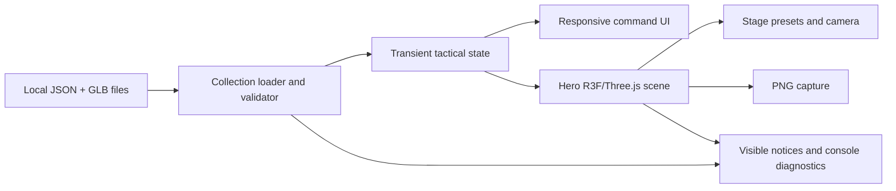

# Digital Shelf Tactical Showcase Design

Date: 2026-09-05
Status: Approved for implementation planning

## Purpose

Digital Shelf is a private, client-only web application for presenting a personal collection of figures, Gunpla, and 3D prints as interactive 3D units. The first product slice is a tactical showcase inspired by robot strategy-game presentation: fixed deployment slots, a hero-dominant 3D model, responsive command controls, and presentation stages.

This is a showcase, not a combat simulator. It has no turns, movement rules, terrain, AI, progression, networking, or public-sharing workflow.

## Goals

The MVP is complete when the user can:

1. Open the app and see valid local collection records.
2. Select a unit from the roster.
3. Place the selected unit in a fixed deployment slot.
4. Inspect one hero GLB/GLTF model with orbit, zoom, and pan controls.
5. Change between 2–3 locally defined tactical stages.
6. See identity-only unit metadata: name, category, description, and tags.
7. Capture the current hero scene as a PNG.
8. Use the app at a narrow mobile viewport.
9. Run the complete experience from a static `dist/` deployment artifact.

## Non-goals

- Combat, turns, movement range, terrain, AI, damage, progression, or campaign systems.
- Multiple simultaneous 3D models.
- Freeform grid placement.
- Saved formations or persistent tactical state.
- Local collection editor or automatic asset import.
- Accounts, authentication, database, API, telemetry, analytics, or remote resources.
- Public distribution of commercial robot IP assets.
- Native iPhone app, AR, model conversion, or server-side rendering.

## Technology decision

Use:

- Vite for development server and production bundling.
- React and TypeScript for the application UI and typed state.
- Three.js for the 3D runtime.
- React Three Fiber for the React-to-Three.js scene boundary.
- Drei for focused reusable Three.js helpers.
- React component state for the MVP; add a state-management library only if state complexity proves it necessary.
- Browser-level smoke tests using the real local `haro-green.glb` fixture.

Vite produces a static `dist/` output suitable for static hosting. Three.js provides GLTFLoader and OrbitControls for local GLB/GLTF loading and camera interaction. React Three Fiber provides reusable scene components while keeping the tactical UI and renderer boundaries explicit.

Research sources:

- [Vite production build](https://vite.dev/guide/build)
- [Vite static deployment](https://vite.dev/guide/static-deploy)
- [Three.js GLTFLoader](https://threejs.org/docs/pages/GLTFLoader.html)
- [React Three Fiber introduction](https://r3f.docs.pmnd.rs/getting-started/introduction)
- [Cloudflare Pages deployment](https://developers.cloudflare.com/workers/wrangler/commands/pages/)
- [Cloudflare Workers Static Assets](https://developers.cloudflare.com/workers/static-assets/)

## Architecture



Boundaries:

- **Collection loader:** fetches local metadata, validates records, skips invalid records, and reports diagnostics.
- **Tactical state:** owns selected unit, fixed slot, active stage, loading status, and capture status. State is transient and resets on refresh/back.
- **Command UI:** owns roster, slot selection, unit identity panel, stage controls, capture action, loading states, and accessible focus behavior.
- **Hero scene:** owns GLB lifecycle, camera, orbit controls, lighting, stage presentation, and renderer cleanup. It must not contain model-specific conditionals.
- **Capture service:** exports the current canvas to PNG and reports non-destructive failure.

## Resource organization

```text
src/
  app UI and tactical state
  R3F scene components
  styles
  tests
public/
  collection.json
  models/*.glb
  textures/*
  fonts/*
  stages.json
dist/
  Vite build output for deployment
```

Runtime-selected GLBs use root-relative public URLs. Large models are not eagerly imported into the JavaScript bundle. All models, metadata, fonts, textures, and libraries are local or bundled; the runtime makes no third-party requests.

## User experience

The hero model dominates the viewport. On mobile, roster, identity, stage, and capture controls collapse into a bottom command sheet. On larger screens, the same content may use a side panel while retaining the hero as the primary visual element.

The tactical scene uses fixed deployment slots. Selecting a roster item changes the active hero model; it does not create a full movement or combat system. Stage presets alter local background, lighting, grid treatment, and camera mood.

Models are static by default. Embedded GLB animation is not required and is not part of the MVP contract.

## Runtime states and failure behavior

States:

- `collection-loading`
- `collection-ready`
- `collection-empty`
- `collection-partial`
- `collection-error`
- `unit-loading`
- `unit-ready`
- `unit-error`
- `capture-ready`
- `capture-error`

Behavior:

- Missing or unreadable collection data shows a visible collection error.
- Empty valid data shows an intentional empty state.
- Invalid records are skipped and counted in a visible non-blocking notice.
- Missing or corrupt GLBs show “Model unavailable” in the hero area while preserving the roster and return action.
- Selecting another unit invalidates the previous load; stale results cannot replace the current hero.
- Refresh and browser Back reset transient tactical state to the default hangar state.
- Capture errors preserve the current scene and offer retry.
- Structured console logs include unit ID, asset path, operation, and error category without sending data remotely.

## Testing and acceptance

Browser smoke coverage must verify:

1. The real local `haro-green.glb` loads successfully.
2. The roster can select a unit.
3. The selected unit can occupy a fixed slot.
4. Orbit, zoom, and pan controls work.
5. Stage presets change the presentation.
6. Identity metadata renders correctly.
7. PNG capture succeeds.
8. Invalid JSON and invalid records produce the specified recovery states.
9. Missing GLB, stale selection, and capture failure produce the specified recovery states.
10. The app remains usable at a narrow mobile viewport.
11. `npm run build` produces a deployable `dist/` directory.

## Local and deployment workflow

Git is already initialized and must be preserved. The implementation work will add the Vite application without reinitializing or destructively cleaning the repository.

Required scripts:

- `npm run dev`
- `npm run build`
- `npm run preview`
- `npm run test`

Primary deployment is Cloudflare Pages with build command `npm run build` and output directory `dist`. Cloudflare Workers Static Assets is a compatible alternative using the same output. No Worker handler is required for the MVP.

Deployment verification must confirm direct app loading, production GLB URLs, PNG capture, narrow viewport behavior, and absence of backend or third-party runtime requests.

## Future decision gates

Only after the vertical showcase is valuable should the project separately consider saved formations, a local metadata editor, multiple simultaneous models, free placement, or a light battle demo. Each requires a new scope decision and must not be inferred from this design.
